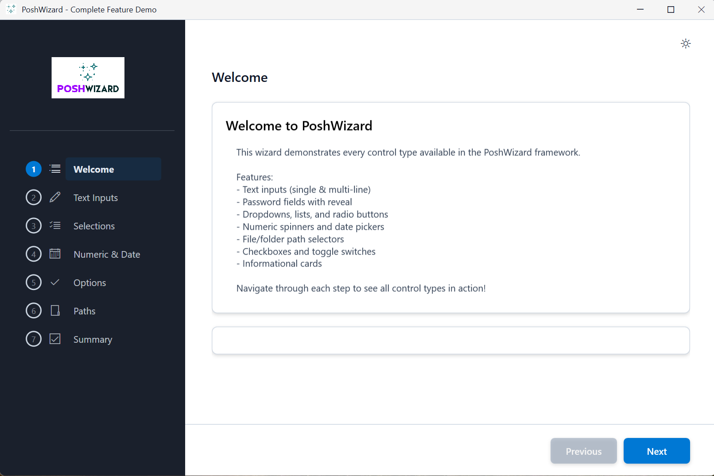
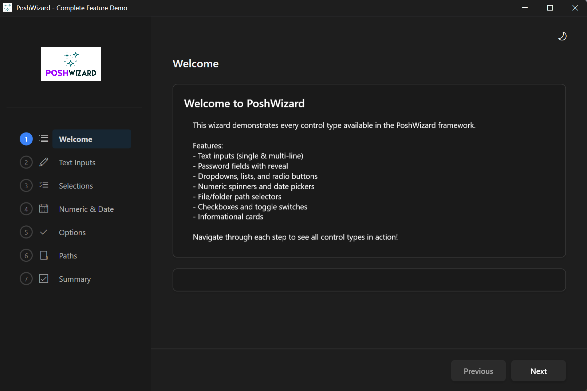
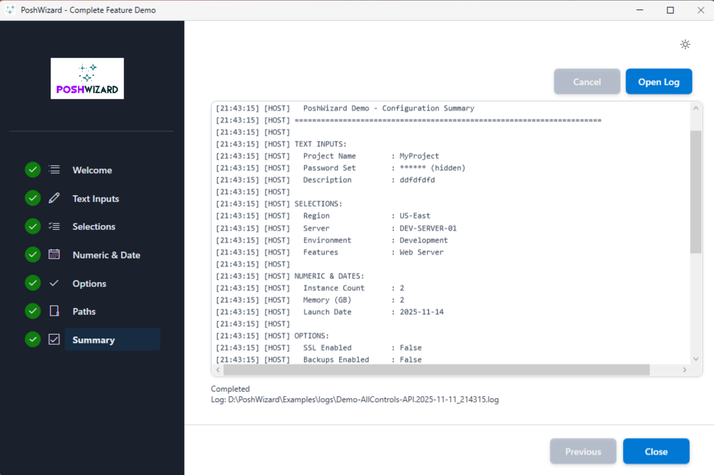

# PoshWizard


[](https://github.com/asolutionit/PoshWizard/releases)
[](LICENSE)
[](https://dotnet.microsoft.com/download/dotnet-framework/net48)
[](https://docs.microsoft.com/en-us/powershell/)

**Maintained by [A Solution IT LLC](https://asolutionit.com)**

---

## What is PoshWizard?

PoshWizard is a PowerShell module that lets you build beautiful, modern Windows 11-style wizards using familiar PowerShell cmdlets—**no WPF or C# required, no third-party libraries needed**. 

Everything you need is already installed on Windows 10/11 and Windows Server 2016+:
- ✅ PowerShell 5.1 (included with Windows)
- ✅ .NET Framework 4.8 (pre-installed on Windows 10+)
- ✅ No external dependencies or NuGet packages
- ✅ No additional software to install

If you've ever built a PowerShell automation script and thought, "This would be perfect if it just had a user-friendly interface," PoshWizard is your answer. It's designed for IT professionals, system administrators, and DevOps engineers who want to make their powerful automation tools accessible to everyone on their team, not just PowerShell experts.

### **PoshWizard in Action**

PoshWizard supports both light and dark themes that automatically adapt to your Windows system preferences:

**Light Theme**



**Dark Theme**



### **The Evolution of PoshWizard**

PoshWizard started as a parameter-attribute project where you'd decorate your script's `param()` block with custom attributes like `[WizardStep]` and `[WizardTextBox]`. While this approach worked, it quickly became clear that **the PowerShell module approach was more powerful and intuitive**.

Using familiar cmdlets like `New-PoshWizard` and `Add-WizardTextBox` feels natural to PowerShell users—you're building wizards the same way you'd build any PowerShell tool. It's more flexible, more dynamic, and frankly, more "PowerShell."

The parameter-attribute approach still exists and works perfectly (you'll see it in some demo scripts), but **we strongly recommend the PowerShell module approach** for new projects. It's the future of PoshWizard and where all new features will land first.

## The Problem It Solves

You've written an amazing PowerShell script that automates a complex task—maybe it creates VMs, configures servers, or deploys applications. It works perfectly... but only if people know how to run PowerShell, understand parameters, and don't make typos. 

Your colleagues keep asking:
- "Which parameters do I need?"
- "What format should the date be in?"
- "Can you just run this for me?"

**PoshWizard bridges that gap.** It takes your PowerShell knowledge and lets you build professional, step-by-step wizard interfaces that anyone can use—complete with validation, helpful descriptions, and that polished Windows 11 look.

## How It Works

PoshWizard uses familiar PowerShell cmdlets to build wizards. If you know how to write PowerShell functions, you already know how to use PoshWizard.

### Execution Model

PoshWizard follows a simple, predictable flow:

1. **Wizard Definition**: Your script defines the wizard structure using PowerShell cmdlets
2. **User Input Collection**: The wizard displays and collects user input
3. **User Clicks Finish**: User completes the wizard and clicks the Finish button
4. **Results Return**: The wizard closes and returns collected data to your script

**Optional: Execute Code During Wizard**

If you provide a `ScriptBody` parameter to `Show-PoshWizard`, your code runs immediately after step 3 (before the wizard closes):

- Your code has access to all collected wizard parameters as variables
- Output displays in the wizard's execution console in real-time
- If your code throws an error, the wizard stays open for review
- After your code completes, the wizard closes and returns results

**Without ScriptBody**: The wizard simply collects data and returns it. Your script then processes the results and performs any business logic.

**With ScriptBody**: The wizard collects data, executes your code inside the wizard session, then returns results.

**Choose based on your needs:**
- Use `ScriptBody` when you want to show progress/results to the user in real-time (quick operations)
- Skip `ScriptBody` when you need complex error handling, external dependencies, or long-running operations

### Execution Console

After the user completes all wizard steps and clicks Finish, PoshWizard displays an execution console that shows:
- **Configuration Summary**: All collected parameters formatted for review
- **Real-time Output**: Any Write-Host, Write-Output, or script results (if using ScriptBody)
- **Status Indicators**: Progress messages and completion status
- **Log Reference**: Path to the detailed execution log file



**With ScriptBody**: The console displays real-time output from your script as it executes inside the wizard session.

**Without ScriptBody**: The console displays the collected parameters and then closes, allowing your calling script to process the results.

See the examples below for both patterns.

Here's a complete working example:

```powershell
# Import the PoshWizard module
$modulePath = Join-Path $PSScriptRoot 'PoshWizard\PoshWizard.psd1'
Import-Module $modulePath -Force

# Initialize the wizard
$wizardParams = @{
    Title = 'Server Setup Wizard'
    Description = 'Configure server deployment settings'
    Theme = 'Auto'
}
New-PoshWizard @wizardParams

# Customize branding
$brandingParams = @{
    WindowTitle = 'Acme Corp - Server Setup'
    SidebarHeaderText = 'Server Deployment'
}
Set-WizardBranding @brandingParams

# Create the first step
$step1Params = @{
    Name = 'ServerInfo'
    Title = 'Server Information'
    Order = 1
    Icon = '&#xE950;'
}
Add-WizardStep @step1Params

# Add a text box for server name
$serverNameParams = @{
    Step = 'ServerInfo'
    Name = 'ServerName'
    Label = 'Server Name'
    ValidationPattern = '^[A-Z][A-Z0-9-]{0,14}$'
    Mandatory = $true
}
Add-WizardTextBox @serverNameParams

# Add a password field
$passwordParams = @{
    Step = 'ServerInfo'
    Name = 'AdminPassword'
    Label = 'Administrator Password'
    MinLength = 12
    Mandatory = $true
}
Add-WizardPassword @passwordParams

# Create a second step
$step2Params = @{
    Name = 'Deployment'
    Title = 'Deployment Options'
    Order = 2
    Icon = '&#xE81E;'
}
Add-WizardStep @step2Params

# Add a dropdown for environment selection
$envParams = @{
    Step = 'Deployment'
    Name = 'Environment'
    Label = 'Target Environment'
    Choices = @('Development', 'Testing', 'Production')
    Default = 'Development'
    Mandatory = $true
}
Add-WizardDropdown @envParams

# Define what happens when the wizard finishes
$scriptBody = {
    Write-Host "`n========================================" -ForegroundColor Cyan
    Write-Host "  Deployment Configuration" -ForegroundColor Cyan
    Write-Host "========================================" -ForegroundColor Cyan
    
    Write-Host "`nServer Name : $ServerName" -ForegroundColor White
    Write-Host "Environment : $Environment" -ForegroundColor White
    
    Write-Host "`nDeploying to $ServerName..." -ForegroundColor Yellow
    
    # Your actual deployment logic goes here
    Start-Sleep -Seconds 2
    
    Write-Host "Deployment complete!" -ForegroundColor Green
}

# Show the wizard and execute the script
Show-PoshWizard -ScriptBody $scriptBody
```

That's it! PoshWizard automatically creates:
- A multi-step wizard with clean sidebar navigation
- Appropriate input controls (text boxes, password fields, dropdowns, etc.)
- Built-in validation that you define
- Optional live execution console (if you provide `ScriptBody`) that streams output in real-time with color-coded streams
- Professional error handling and CMTrace-compatible logging

**Two execution patterns:**
1. **Simple mode** - Wizard collects data, returns results to your script for processing
2. **Live execution mode** - Wizard collects data, executes `ScriptBody` immediately, then returns results

## The PowerShell Way

PoshWizard feels natural to PowerShell users because it uses:

- **Standard cmdlets**: `New-PoshWizard`, `Add-WizardStep`, `Add-WizardTextBox`
- **Hashtable splatting**: Clean, readable parameter definitions
- **Familiar patterns**: Works like building any PowerShell tool
- **Scriptblocks**: Use `{ }` for dynamic content and execution logic

No XML, no XAML, no learning WPF—just PowerShell.

### **How It Works: EXE + Module Architecture**

Curious about how the PowerShell module and WPF executable work together? See **[ARCHITECTURE.md](Docs/ARCHITECTURE.md)** for a detailed explanation of:
- How the module generates scripts and launches the EXE
- What happens behind the scenes when you call `Show-PoshWizard`
- Why this hybrid approach gives you the best of both worlds
- How to modify the UI if needed

**TL;DR:** You write PowerShell. The module handles the complexity. The EXE provides the beautiful UI.

## Available Controls

PoshWizard provides cmdlets for every common input type:

### **Input Controls**
- `Add-WizardTextBox` - Single-line text input
- `Add-WizardMultiLine` - Multi-line text areas
- `Add-WizardPassword` - Secure password input with reveal button
- `Add-WizardNumeric` - Numeric spinners with min/max ranges
- `Add-WizardDate` - Calendar-based date selection

### **Selection Controls**
- `Add-WizardDropdown` - ComboBox for single selection
- `Add-WizardListBox` - Scrollable list (single or multi-select)
- `Add-WizardOptionGroup` - Radio buttons for mutually exclusive choices

### **Boolean Controls**
- `Add-WizardCheckbox` - Traditional checkboxes
- `Add-WizardToggle` - Modern toggle switches

### **Path Controls**
- `Add-WizardFilePath` - File browser with filters
- `Add-WizardFolderPath` - Folder selection dialog

### **Display Controls**
- `Add-WizardCard` - Information cards with formatted content

### **Dynamic Data**

From `Demo-DynamicControls.ps1` - all controls support scriptblocks for dynamic content:

```powershell
# Dynamic region dropdown depends on environment selection
$regionParams = @{
    Step = 'Region'
    Name = 'DeploymentRegion'
    Label = 'Deployment Region'
    ScriptBlock = {
        param($TargetEnvironment)
        
        switch ($TargetEnvironment) {
            'Production' {
                @('US-East-1', 'US-West-2', 'EU-Central-1', 'EU-West-1', 'AP-Southeast-1', 'AP-Northeast-1')
            }
            'Staging' {
                @('US-East-1-Staging', 'EU-Central-1-Staging', 'AP-Southeast-1-Staging')
            }
            'Development' {
                @('Dev-Local', 'Dev-Cloud-US', 'Dev-Cloud-EU')
            }
        }
    }
    DependsOn = @('TargetEnvironment')
    Mandatory = $true
}
Add-WizardDropdown @regionParams
```

> **Note on DependsOn**: The `DependsOn` parameter is **optional** when using `ScriptBlock`. If omitted, the module automatically detects dependencies from your `ScriptBlock`'s `param()` declarations. Explicit `DependsOn` is useful for clarity or when parameter names differ from control names.

## Learning by Example

The best way to learn PoshWizard is to explore the comprehensive documentation and example wizards:

### **📖 Start Here: 01_PoshWizard_CMDLET_Guide**
The complete reference for building wizards with PowerShell cmdlets. This is your primary learning resource and includes:

- **All Available Cmdlets**: Complete documentation for every `New-`, `Add-`, `Set-`, and `Show-` cmdlet
- **Hashtable Splatting Patterns**: Clean, readable syntax with no backticks
- **Dynamic Data Sources**: Scriptblocks for conditional logic and cascading dropdowns
- **Validation Techniques**: Regex patterns, mandatory fields, min/max values
- **Real-World Examples**: From simple to complex, copy-paste ready

**Featured Examples in the Guide:**

1. **Simple Configuration Wizard** - Perfect first project
   - Basic two-step wizard with text input and dropdown
   - Shows fundamental patterns and validation
   - ~40 lines of clear, commented code

2. **Dynamic Cascading Wizard** - Intermediate level
   - Dropdowns that populate based on previous selections
   - Demonstrates scriptblocks and conditional logic
   - Real-world data-driven scenarios

3. **Complete Server Deployment** - Production-ready
   - Multi-step workflow with all control types
   - Information cards, validation, branding
   - Shows best practices for enterprise tools

### **🎯 PoshWizard Cmdlets Demo Wizards**

The repository includes complete, working wizards built with PoshWizard Cmdlets. These demos show real-world usage patterns and best practices:

#### **🌟 Demo-AllControls.ps1** - Start Here!
**Your first stop for learning PoshWizard.**

Comprehensive showcase of every control type using clean hashtable splatting syntax throughout. This is the best way to see what's possible and learn the splatting pattern:

- Text inputs (single-line, multi-line, password with reveal)
- Selection controls (dropdowns, listboxes, radio buttons with CSV data)
- Numeric spinners and date pickers with ranges
- Boolean controls (checkboxes, toggle switches)
- File and folder path selectors with filters
- Information cards for step guidance
- Complete validation examples

**What you'll learn:** All control types, splatting syntax, validation patterns

**Run it:**
```powershell
.\Demo-AllControls.ps1
```

#### **💻 Demo-HyperV-CreateVM.ps1** - Real-World Production Example
**Production-ready wizard for creating Hyper-V virtual machines.**

Shows how to build a complete, multi-step workflow for actual infrastructure automation. Demonstrates mixing hashtable splatting with direct parameter passing:

- Welcome page with prerequisites and documentation links
- VM identity configuration with naming validation
- Resource allocation (CPU cores, memory with min/max)
- Storage configuration with dynamic path selection
- Network setup with virtual switch selection
- Final review step with post-wizard execution

**Important:** This demo shows **post-wizard processing** pattern—the wizard collects configuration, then the calling script performs the actual VM creation after the wizard returns. This is the recommended pattern for complex operations.

Perfect example of building enterprise IT automation wizards.

**What you'll learn:** Real-world workflow, both coding styles, post-wizard processing pattern

**Run it:**
```powershell
.\Demo-HyperV-CreateVM.ps1
```

#### **🔒 Demo-PasswordValidation.ps1** - Security & Validation Showcase
**Four password validation scenarios with rich UI guidance.**

Demonstrates both regex-based and script-based validation with educational cards:

- Simple minimum length validation (8+ characters)
- Complex pattern validation (12+ with uppercase, lowercase, number, symbol)
- Script-based custom validation with business rules
- Optional passwords with lightweight guidance

Each scenario includes information cards explaining the policy to users.

**What you'll learn:** Validation techniques, secure password handling, user guidance patterns

**Run it:**
```powershell
.\Demo-PasswordValidation.ps1
```

#### **🔄 Demo-DynamicControls.ps1** - Advanced Cascading Dependencies
**Complex dynamic behaviors with multi-level dependencies.**

Advanced demonstration of cascading dropdowns and dynamic data with CSV sources:

- 3-level cascading: Environment -> Region -> Server
- CSV-backed dynamic data sources
- Application selection with conditional database requirements
- Multi-level dependency chains with real-time updates
- Creates sample CSV files in temp directory for testing

Shows how to build data-driven wizards that adapt based on selections.

**What you'll learn:** Cascading dropdowns, scriptblocks, CSV data sources, complex dependencies

**Run it:**
```powershell
.\Demo-DynamicControls.ps1
```

#### **📊 Demo-Cascading-overlay.ps1** - Progress Overlay Behavior
**Understand the progress overlay with dependent dropdowns.**

Focused demo showing how the UI handles loading states:

- Static dropdown (no overlay)
- Single dependency with immediate overlay
- Nested dependencies with multiple overlays
- Chain resolution visualization

Educational cards explain when and why overlays appear.

**What you'll learn:** Progress overlay behavior, UX patterns, async loading feedback

**Run it:**
```powershell
.\Demo-Cascading-overlay.ps1
```

### **💡 Learning Path**

We recommend this progression:

1. **Read the Quick Start** (in this README) - 5 minutes
2. **Run `Demo-AllControls.ps1`** to see all controls in action - 10 minutes
   - This demo uses hashtable splatting throughout - great for learning that pattern
3. **Open 01_PoshWizard_CMDLET_Guide** and read through the cmdlets - 20 minutes
4. **Copy and modify the "Simple Configuration Wizard"** from the guide - 15 minutes
5. **Run `Demo-HyperV-CreateVM.ps1`** for a real-world example - 10 minutes
   - Shows both splatting and direct parameter styles in production code
6. **Explore specialized demos** based on your needs:
   - Need validation? Run `Demo-PasswordValidation.ps1`
   - Need cascading dropdowns? Run `Demo-DynamicControls.ps1` or `Demo-Cascading-overlay.ps1`
7. **Build your first real wizard** for your own use case - 1 hour

By the end of this path, you'll be comfortable building production wizards for your organization.

### **💻 Coding Styles in Demos**

The demos show both valid PowerShell approaches:

**Hashtable Splatting (from Demo-AllControls.ps1):**
```powershell
$step2Params = @{
    Name = 'TextInputs'
    Title = 'Text Inputs'
    Order = 2
    Icon = '&#xE70F;'
    Description = 'Single-line, multi-line, and password fields'
}
Add-WizardStep @step2Params
```

**Direct Parameters (from Demo-HyperV-CreateVM.ps1):**
```powershell
Add-WizardStep -Name 'Welcome' -Title 'Welcome' -Order 1 `
    -Icon '&#xE950;' `
    -Description 'Create a new Hyper-V Virtual Machine'
```

Both styles work perfectly. Use whichever you prefer:
- **Splatting** is great for complex controls with many parameters
- **Direct parameters** are concise for simpler calls

The demos mix both to show you're free to choose your style.

### **📝 All Demos Use PoshWizard Cmdlets**

Every demo uses the recommended PoshWizard Cmdlets approach:
- Standard PowerShell cmdlets (`New-PoshWizard`, `Add-WizardStep`, etc.)
- Easy to read and modify
- Just run them directly: `.\Demo-Name.ps1`
- No special launcher needed

These are your best learning resources and starting templates!

## Key Features

### **For PowerShell Developers**
- **Native PowerShell**: Uses cmdlets, hashtables, and scriptblocks you already know
- **No GUI Framework Knowledge Required**: Zero WPF, XAML, or C# needed
- **Dynamic and Flexible**: Build wizards that adapt at runtime
- **Standard Validation**: Use regex patterns, min/max, mandatory fields

### **For End Users**
- **Modern Windows 11 Design**: Translucent effects, rounded corners, native styling
- **Light & Dark Themes**: Automatic theme switching
- **Live Execution Console**: Watch your script run in real-time
- **Professional Look**: Polished interface that builds trust

### **For Organizations**
- **Secure by Design**: Proper SecureString handling for passwords
- **CMTrace-Compatible Logging**: Detailed audit trails for every execution
- **No Installation Required**: Pure PowerShell and .NET Framework 4.8
- **Single Executable**: Distribute as `PoshWizard.exe` with your scripts

## The Philosophy

PoshWizard is built on a simple principle: **PowerShell automation should be accessible to everyone, not just PowerShell experts.**

We believe:
- Automation shouldn't require users to understand command-line syntax
- Good UIs make good scripts great
- IT professionals shouldn't need to learn web frameworks or WPF to build user-friendly tools
- PowerShell is powerful enough—it just needs a friendly face

PoshWizard lets you leverage your PowerShell expertise to create tools that your entire organization can use confidently. Whether you're building a simple configuration wizard for your help desk or a complex deployment tool for your infrastructure team, PoshWizard scales with your needs.

## Real-World Use Cases

The included demos demonstrate these production scenarios:

- **VM/Server Provisioning**: `Demo-HyperV-CreateVM.ps1` shows complete Hyper-V VM creation
- **Secure Credential Collection**: `Demo-PasswordValidation.ps1` demonstrates password validation patterns
- **Dynamic Configuration**: `Demo-DynamicControls.ps1` shows environment-based cascading selections

These patterns can be adapted for your organization's automation needs.

## Installation

### **Prerequisites**
- Windows 10/11 or Windows Server 2016+
- .NET Framework 4.8 (usually pre-installed on Windows 10+)
- PowerShell 5.1 (included with Windows)

**That's it! No third-party libraries, no NuGet packages, no additional software needed.**

### **Option 1: Download Pre-Built Release** (Recommended)

For users who want a ready-to-use package with the signed executable and PoshWizard module already included:

1. Download the latest release from [Releases](https://github.com/asolutionit/PoshWizard/releases)
2. Extract to your preferred location
3. Unblock the files:
   ```powershell
   Get-ChildItem -Recurse | Unblock-File
   ```

The release package includes:
- Pre-compiled `PoshWizard.exe` (code-signed)
- Complete PoshWizard PowerShell module
- All demo scripts and examples
- Full documentation

**Ready to use immediately!** No build steps required.

### **Option 2: Build from Source**

For developers who want to build PoshWizard from source:

```powershell
# Clone the repository
git clone https://github.com/asolutionit/PoshWizard.git
cd PoshWizard

# Build the solution
# This compiles the C# launcher and automatically places PoshWizard.exe 
# in the correct location for the PowerShell module
dotnet build WizardFramework.sln --configuration Release

# Or use MSBuild
msbuild WizardFramework.sln /p:Configuration=Release
```

The build process automatically:
- Compiles the WPF launcher executable
- Places `PoshWizard.exe` in `PoshWizard\bin\` for module use
- Creates logs directory structure

**You're done!** The module is ready to use.

### **Verify Installation**

Test that everything works:

```powershell
# Import the module
Import-Module .\PoshWizard\PoshWizard.psd1 -Force

# Create a simple test wizard
New-PoshWizard -Title 'Test' -Description 'Testing installation' -Theme 'Auto'
Add-WizardStep -Name 'Test' -Title 'Test Step' -Order 1
Add-WizardTextBox -Step 'Test' -Name 'TestField' -Label 'Enter anything'

# Show it
Show-PoshWizard
```

If the wizard appears, PoshWizard is installed correctly!

---

## Quick Start

### **1. Import the Module**

```powershell
# Navigate to your PoshWizard directory
cd C:\Path\To\PoshWizard

# Import the module
$modulePath = Join-Path $PSScriptRoot 'PoshWizard\PoshWizard.psd1'
Import-Module $modulePath -Force
```

### **2. Build Your First Wizard**

Create a simple wizard in under 30 lines:

```powershell
# Import module
$modulePath = Join-Path $PSScriptRoot 'PoshWizard\PoshWizard.psd1'
Import-Module $modulePath -Force

# Initialize wizard
$wizardParams = @{
    Title = 'My First Wizard'
    Description = 'A simple example'
    Theme = 'Auto'
}
New-PoshWizard @wizardParams

# Add a step
$stepParams = @{
    Name = 'Info'
    Title = 'User Information'
    Order = 1
}
Add-WizardStep @stepParams

# Add a text box
$nameParams = @{
    Step = 'Info'
    Name = 'FullName'
    Label = 'Your Name'
    Mandatory = $true
}
Add-WizardTextBox @nameParams

# Show wizard
Show-PoshWizard
```

### **3. Run Your Wizard**

Execute your script directly - it's just PowerShell:

```powershell
.\MyFirstWizard.ps1
```

**That's it!** Your wizard appears, collects user input, and returns the results. No special launcher, no complex setup—just PowerShell doing what it does best.

### **4. Learn More**

Continue your learning journey:

- **Next Step**: Open `01_PoshWizard_CMDLET_Guide` for the complete cmdlet reference
- **Examples**: Explore the `Examples/` folder for real-world wizards
- **Customize**: Modify the examples to fit your specific needs
- **Build**: Create your first production wizard for your organization

### **Important for PowerShell 5.1 Users**

Avoid using Unicode emojis or special glyphs in your `.ps1` wizard scripts. PowerShell 5.1 requires scripts to be saved as UTF-8 with BOM or use ASCII-only characters. Reserve emoji usage for Markdown documentation. See the coding guidelines in `CONTRIBUTING.md` for details.

## PoshWizard Cmdlets vs Parameter Attributes

PoshWizard originally supported a parameter-attribute approach where wizard metadata was embedded in your script's `param()` block. While this still works, **PoshWizard Cmdlets is now the recommended and supported approach**.

### **PoshWizard Cmdlets** ⭐ (Recommended - Focus Here)

Uses familiar PowerShell cmdlets to build wizards programmatically:

```powershell
Import-Module .\PoshWizard\PoshWizard.psd1
New-PoshWizard -Title 'My Wizard' -Theme 'Auto'
Add-WizardStep -Name 'Config' -Title 'Configuration' -Order 1
Add-WizardTextBox -Step 'Config' -Name 'ServerName' -Label 'Server Name'
Show-PoshWizard
```

**Execute:** Just run your script: `.\MyWizard.ps1`

**Why this approach?**
- **Natural PowerShell** - Uses cmdlets you already understand
- **Dynamic and flexible** - Build wizards that adapt at runtime
- **Easy to debug** - Explicit function calls are easy to trace
- **Simple execution** - No special launcher needed
- **Future-proof** - All new features land here first

**Documentation:** `01_PoshWizard_CMDLET_Guide` has everything you need

### **Parameter Attributes** (Legacy - Supported but not recommended)

The original approach using custom attributes in `param()` blocks. Still functional but less flexible:

```powershell
param(
    [WizardStep('Config', 1)]
    [WizardTextBox(Label='Server Name')]
    [string]$ServerName
)
```

**Execute:** Requires launcher: `PoshWizard.exe .\MyScript.ps1`

Some demo scripts use this approach to showcase UI capabilities, but **new projects should use PoshWizard Cmdlets**.

### **For New Projects**

Use PoshWizard Cmdlets. It's more powerful, easier to learn, and simpler to deploy. The rest of this README focuses exclusively on the cmdlet approach.

## Project Structure

```
PoshWizard/
├── Launcher/                 # C# WPF Application (builds PoshWizard.exe)
│   ├── App.xaml             # Application entry point
│   ├── MainWindow.xaml      # Main UI
│   ├── Styles/              # WPF themes and styles
│   └── Controls/            # Custom WPF controls
├── PoshWizard/              # PowerShell Module
│   ├── PoshWizard.psd1      # Module manifest
│   ├── PoshWizard.psm1      # Module implementation
│   ├── bin/                 # Contains PoshWizard.exe after build
│   └── Public/              # Exported cmdlets
├── Examples/                # Demo wizards
│   ├── Demo-AllControls.ps1
│   ├── Demo-HyperV-CreateVM.ps1
│   ├── Demo-PasswordValidation.ps1
│   └── Demo-DynamicControls.ps1
├── Docs/                    # Documentation
│   ├── 01_PoshWizard_CMDLET_Guide.md
│   ├── 02_CONTROLS_GUIDE.md
│   └── 03_ARCHITECTURE.md
└── logos/                   # Branding assets
```

## Simple Example

Here's a complete, minimal wizard in ~25 lines:

```powershell
# Import module
$modulePath = Join-Path $PSScriptRoot 'PoshWizard\PoshWizard.psd1'
Import-Module $modulePath -Force

# Initialize wizard
$wizardParams = @{
    Title = 'Quick Setup'
    Description = 'Simple configuration example'
    Theme = 'Auto'
}
New-PoshWizard @wizardParams

# Add step
$stepParams = @{
    Name = 'Config'
    Title = 'Configuration'
    Order = 1
}
Add-WizardStep @stepParams

# Add controls
$serverParams = @{
    Step = 'Config'
    Name = 'ServerName'
    Label = 'Server Name'
    Mandatory = $true
}
Add-WizardTextBox @serverParams

$envParams = @{
    Step = 'Config'
    Name = 'Environment'
    Label = 'Environment'
    Choices = @('Dev', 'Test', 'Prod')
    Mandatory = $true
}
Add-WizardDropdown @envParams

# Execute
$scriptBody = {
    Write-Host "Configuring $ServerName in $Environment..." -ForegroundColor Cyan
    
    # Your logic here
    Start-Sleep -Seconds 2
    
    Write-Host "Configuration complete!" -ForegroundColor Green
}

Show-PoshWizard -ScriptBody $scriptBody
```

## Best Practices

Learn from patterns in the demos:

### **1. Validate User Input**

From `Demo-PasswordValidation.ps1` - use validation patterns:

```powershell
Add-WizardPassword -Step 'PatternRules' -Name 'ComplexPassword' `
    -Label 'Complex Password (12+ with full character mix)' `
    -ValidationPattern '^(?=.*[A-Z])(?=.*[a-z])(?=.*\d)(?=.*[@$!%*?&])[A-Za-z\d@$!%*?&]{12,}$' `
    -ValidationMessage 'Must be 12+ characters with uppercase, lowercase, number, and special character.' `
    -Mandatory
```

### **2. Provide Helpful Cards**

From `Demo-HyperV-CreateVM.ps1` - guide users with information cards:

```powershell
Add-WizardCard -Step 'Identity' -Name 'IdentityInfoCard' `
    -Title 'VM Naming Guidelines' `
    -Content @'
Choose a unique, descriptive name for your virtual machine:

• Use letters, numbers, hyphens, and underscores only
• Maximum 64 characters
• Avoid spaces and special characters
• Use a naming convention (e.g., Env-Purpose-##)

Examples: Dev-WebServer-01, SQL-Prod-DB, Test-App-Server
'@
```

### **3. Use Descriptive Names**

From the demos - make your code self-documenting:

```powershell
# Good - from Demo-HyperV-CreateVM.ps1
Add-WizardTextBox -Step 'Identity' -Name 'VMName' -Label 'Virtual Machine Name'

# Avoid
Add-WizardTextBox -Step 'Step2' -Name 'Field1' -Label 'Name'
```

## Logging and Debugging

PoshWizard creates CMTrace-compatible logs for every execution:

### **Log Locations**
- **Per-Execution Logs**: `logs/<ScriptName>.<timestamp>.log`
- **Host Application Log**: `logs/PoshWizard.log`

### **View Logs**

```powershell
# Open logs folder
Invoke-Item (Join-Path $PSScriptRoot 'logs')

# View latest log
Get-Content (Get-ChildItem -Path 'logs\*.log' | Sort-Object LastWriteTime -Descending | Select-Object -First 1).FullName
```

### **Log Levels**

Logs include all PowerShell streams:
- **Information**: `Write-Host`, `Write-Information`
- **Verbose**: `Write-Verbose`
- **Warning**: `Write-Warning`
- **Error**: `Write-Error`, exceptions
- **Debug**: `Write-Debug`

Use these cmdlets in your wizard code and ScriptBody to control log output.

## Theming

PoshWizard includes light and dark themes:

- **Auto**: Matches Windows system theme (default)
- **Light**: Forces light theme
- **Dark**: Forces dark theme

Users can toggle themes with the sun/moon button in the UI.

Set theme when initializing (from `Demo-AllControls.ps1`):

```powershell
$wizardParams = @{
    Title = 'PoshWizard - Complete Feature Demo'
    Description = 'Comprehensive demonstration using PoshWizard Cmdlets'
    Theme = 'Auto'  # or 'Light', 'Dark'
}
New-PoshWizard @wizardParams
```

## Security Considerations

### **Password Handling**

From `Demo-PasswordValidation.ps1` - use `Add-WizardPassword` for sensitive data:

```powershell
# Simple password with minimum length
Add-WizardPassword -Step 'PatternRules' -Name 'SimplePassword' `
    -Label 'Simple Password (minimum 8 characters)' `
    -MinLength 8 -Mandatory

# Complex password with validation
Add-WizardPassword -Step 'PatternRules' -Name 'ComplexPassword' `
    -Label 'Complex Password (12+ with full character mix)' `
    -ValidationPattern '^(?=.*[A-Z])(?=.*[a-z])(?=.*\d)(?=.*[@$!%*?&])[A-Za-z\d@$!%*?&]{12,}$' `
    -ValidationMessage 'Must be 12+ characters with uppercase, lowercase, number, and special character.' `
    -Mandatory
```

Passwords are returned as `SecureString` objects and can be used in your ScriptBody for credential creation.


### **Execution Policy**

Ensure PowerShell can run your scripts:

```powershell
Set-ExecutionPolicy -ExecutionPolicy RemoteSigned -Scope CurrentUser
```

## Troubleshooting

### **"Module not found"**

Ensure the path to `PoshWizard.psd1` is correct:

```powershell
$modulePath = Join-Path $PSScriptRoot 'PoshWizard\PoshWizard.psd1'
if (-not (Test-Path $modulePath)) {
    throw "Module not found at: $modulePath"
}
Import-Module $modulePath -Force
```

### **"PoshWizard.exe not found"**

Build the solution first:

```powershell
dotnet build WizardFramework.sln --configuration Release
```

### **Controls not appearing**

Verify the step name matches exactly:

```powershell
# Step name
Add-WizardStep -Name 'Config' -Title 'Configuration' -Order 1

# Control must use same name
Add-WizardTextBox -Step 'Config' -Name 'ServerName' -Label 'Server'
```

### **Validation not working**

Check your regex pattern:

```powershell
# Test regex separately
'SERVER-01' -match '^[A-Z][A-Z0-9-]{0,14}$'  # Should return True
```

## Contributing

We welcome contributions! Please see:

- **[CONTRIBUTING.md](CONTRIBUTING.md)** - Development guidelines
- **[CODE_OF_CONDUCT.md](CODE_OF_CONDUCT.md)** - Community standards
- **[SECURITY.md](SECURITY.md)** - Security policy

Areas we'd love help with:
- Additional control types
- More example wizards
- Documentation improvements
- Bug fixes and testing
- Internationalization/localization

## Documentation

- **[01_PoshWizard_CMDLET_Guide](Docs/01_PoshWizard_CMDLET_Guide.md)** - Complete cmdlet reference
- **[02_CONTROLS_GUIDE.md](Docs/02_CONTROLS_GUIDE.md)** - UI controls detailed guide
- **[CHANGELOG.md](CHANGELOG.md)** - Version history

## Support

- **GitHub Issues**: [Report bugs or request features](https://github.com/asolutionit/PoshWizard/issues)
- **GitHub Discussions**: [Ask questions and share ideas](https://github.com/asolutionit/PoshWizard/discussions)
- **Email**: support@asolutionit.com

## License

This project is licensed under the MIT License - see the [LICENSE](LICENSE) file for details.

Copyright (c) 2025 A Solution IT LLC. All rights reserved.

## Acknowledgments

Special thanks to:
- The PowerShell community for inspiration and feedback
- Microsoft for the WPF framework
- All contributors who help make PoshWizard better

## About A Solution IT LLC

PoshWizard is developed and maintained by [A Solution IT LLC](https://asolutionit.com), a technology consulting firm specializing in IT automation and infrastructure solutions.

- **Website**: [https://asolutionit.com](https://asolutionit.com)
- **GitHub**: [https://github.com/asolutionit](https://github.com/asolutionit)
- **Email**: support@asolutionit.com

---

**Current Version: 1.4.3**

**Build beautiful PowerShell wizards the PowerShell way.** 🚀
